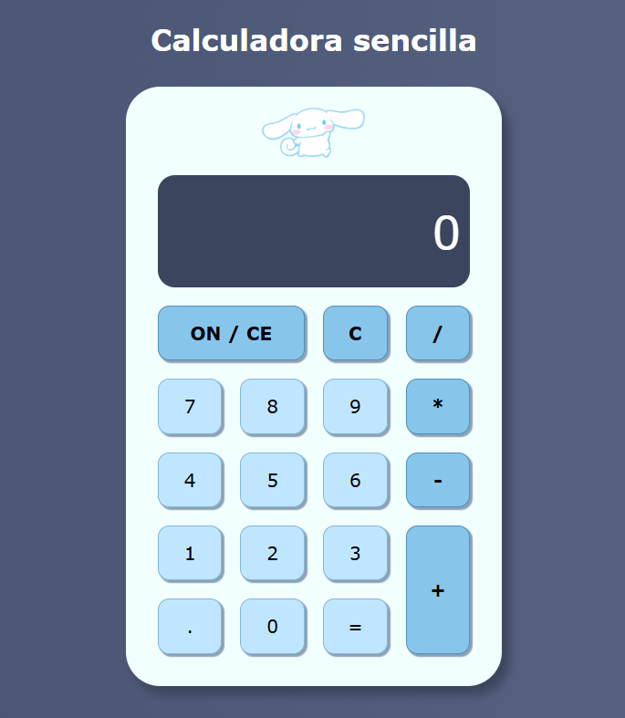

# ☁️ Calculadora Cinnamoroll

Una calculadora web simple, estética y funcional inspirada en el personaje **Cinnamoroll** de Sanrio. Este proyecto fue creado para practicar lógica de programación con JavaScript y maquetación con CSS Grid.



## 📋 Características

- **Operaciones Básicas:** Suma, resta, multiplicación y división.
- **Diseño Kawaii:** Interfaz de usuario con colores pasteles (azules y blancos) y bordes redondeados, acompañados de una ilustración accesible de Cinnamoroll.
- **Control de Errores:** Manejo de sintaxis inválida (muestra "Error" en pantalla).
- **Límite de Caracteres:** La pantalla y los resultados están limitados a 10 dígitos para mantener el diseño limpio.
- **Botones de Control:**
  - `ON / CE`: Reinicio total de la calculadora.
  - `C`: Borrado carácter por carácter (backspace).

## 🛠️ Tecnologías Usadas

- **HTML5:** Estructura semántica (uso de `<main>`, `<header>`, `accessibilidad`).
- **CSS3:**
  - **CSS Grid:** Para la disposición de los botones.
  - **Flexbox:** Para el centrado general en la página.
  - **Gradientes:** Fondo estético linear-gradient.
- **JavaScript (Vanilla):** Lógica del DOM, manejo de eventos y evaluaciones matemáticas.

## 🚀 Cómo usar este proyecto

1. **Clonar el repositorio:**
   ```bash
   git clone [https://github.com/EvePulido/calculadoraSencilla.git](https://github.com/EvePulido/calculadoraSencilla.git)